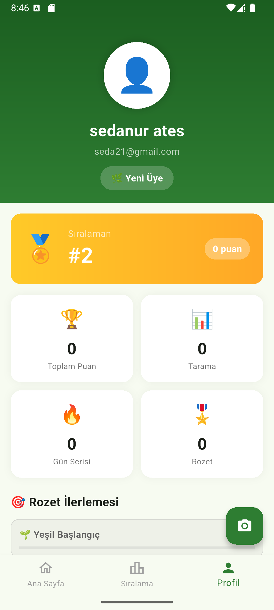

# 🌍 Ecosfer - Akıllı Atık Tanıma Uygulaması

  <strong>Atığını tanısın, doğa kazansın!</strong>

---

## 📱 Hakkında

Ecosfer, yapay zeka destekli bir mobil uygulamadır. Kullanıcılar atık maddelerinin fotoğrafını çekerek hangi geri dönüşüm kutusuna atmaları gerektiğini öğrenebilir. Uygulama, çevresel farkındalığı artırmak ve geri dönüşümü teşvik etmek amacıyla geliştirilmiştir.

## ✨ Özellikler

- 📷 **Akıllı Atık Tanıma:** YOLOv8 yapay zeka modeli ile atık türü tespiti
- 🗑️ **Doğru Kutu Önerisi:** Plastik, cam, metal, kağıt ve organik atıklar için kutu rengi önerisi
- 🏆 **Puan Sistemi:** Her tarama için puan kazanma
- 📊 **Liderlik Tablosu:** Kullanıcılar arası rekabet
- 🎖️ **Rozet Sistemi:** Başarılara göre rozet kazanma
- 👤 **Kullanıcı Profili:** Kişisel istatistikler ve ilerleme takibi
- 💡 **Geri Dönüşüm İpuçları:** Günlük çevre bilgilendirmeleri

## 📸 Ekran Görüntüleri

  
  
  
  
  

## 🛠️ Teknolojiler

| Teknoloji | Açıklama |
|-----------|----------|
| Flutter | Cross-platform mobil framework |
| Dart | Programlama dili |
| Supabase | Backend-as-a-Service (Auth & Database) |
| YOLOv8 | Nesne tanıma modeli |

## 🎯 Atık Türleri ve Kutular

| Atık Türü | Kutu Rengi | Emoji |
|-----------|------------|-------|
| Plastik | 🟡 Sarı | ♻️ |
| Cam | 🟢 Yeşil | 🫙 |
| Metal | ⚫ Gri | 🥫 |
| Kağıt | 🔵 Mavi | 📄 |
| Organik | 🟤 Kahverengi | 🍂 |

## 🏅 Rozet Sistemi

| Rozet | Gerekli Puan |
|-------|--------------|
| 🌱 Yeşil Başlangıç | 10 |
| 🦸 Eko Savaşçı | 50 |
| 🏆 Yeşil Kahraman | 100 |
| 👑 Geri Dönüşüm Ustası | 250 |
| 🌍 Dünya Koruyucusu | 500 |

---

  🌍 Dünyamız için geri dönüşüm! ♻️

