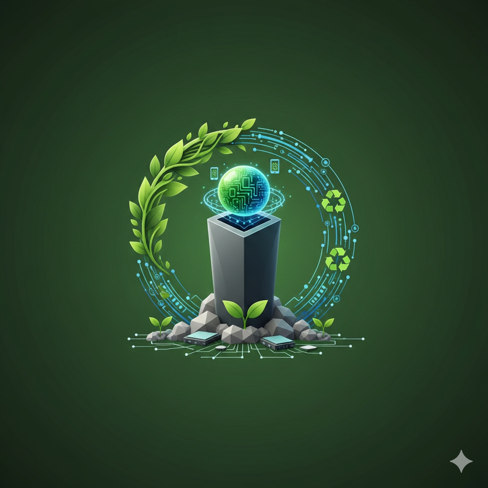
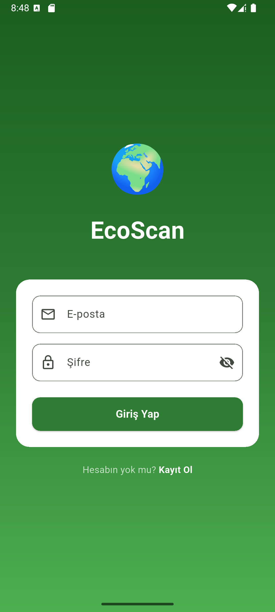
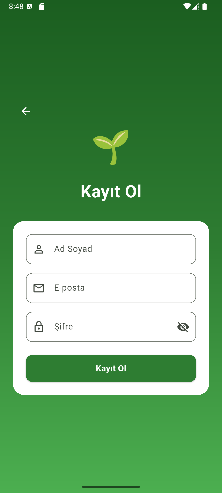
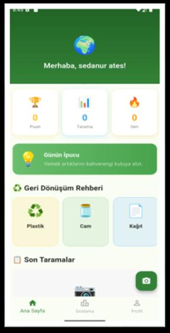
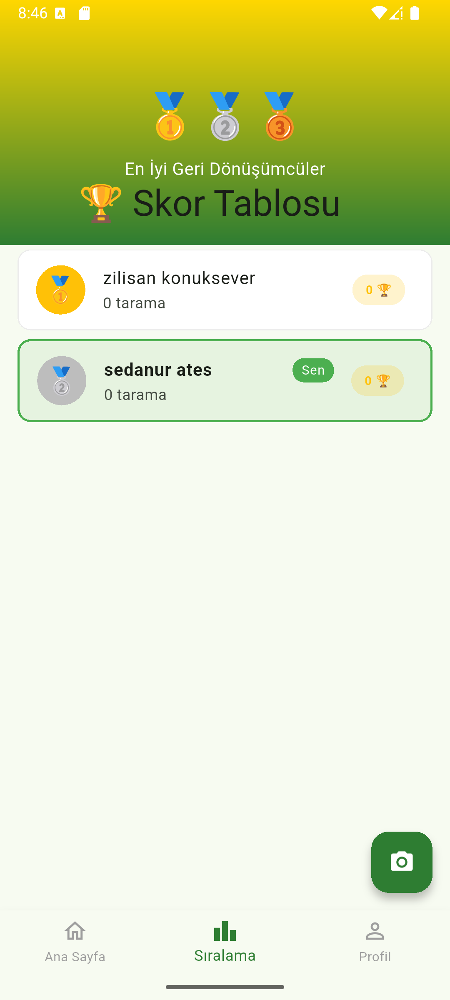

# 🌍 Ecosfer - Akıllı Atık Yönetim ve Geri Dönüşüm Asistanı

<p align="center">
  
  <br>
  <strong>"Atığını Tani, Geleceği Koru!"</strong>
</p>

<p align="center">
  <a href="#-özellikler">Özellikler</a> •
  <a href="#-teknolojiler">Teknolojiler</a> •
  <a href="#-kurulum">Kurulum</a> •
  <a href="#-ekran-görüntüleri">Ekran Görüntüleri</a> •
  <a href="#-api-mimarisi">API</a>
</p>

---

## 📱 Proje Hakkında

**Ecosfer**, yapay zeka destekli görüntü işleme teknolojilerini kullanarak atık yönetimini oyunlaştıran modern bir mobil uygulamadır. Kullanıcılar, ellerindeki atığın fotoğrafını çekerek saniyeler içinde hangi materyalden yapıldığını (Plastik, Cam, Metal, Kağıt, Organik) ve hangi geri dönüşüm kutusuna atılması gerektiğini öğrenirler.

Bu proje, Birleşmiş Milletler Sürdürülebilir Kalkınma Amaçları (Sorumlu Tüketim ve Üretim) doğrultusunda çevre bilincini artırmayı hedefler.

## ✨ Özellikler

### 🤖 Yapay Zeka Destekli Analiz
*   **Anlık Tanıma:** `YOLOv8` modeli ile atıkları milisaniyeler içinde sınıflandırır.
*   **Görsel İşleme:** Python `FastAPI` tabanlı backend servisi ile yüksek doğruluklu analiz.
*   **Akıllı Yönlendirme:** Atığın türüne göre doğru geri dönüşüm kutusu (Sarı, Yeşil, Mavi vb.) önerisi.

### 🎮 Oyunlaştırma (Gamification)
*   **Puan Sistemi:** Her doğru ayrıştırma işlemi için +10 puan.
*   **Liderlik Tablosu:** En çok geri dönüşüm yapan "Çevre Dostu" kullanıcılar sıralaması.
*   **Rozetler:** Puan topladıkça kazanılan unvanlar (Örn: *Eko Savaşçı*, *Dünya Koruyucusu*).

### 👤 Kullanıcı Deneyimi
*   **Profil Yönetimi:** Kişisel istatistikler, toplam puan ve tarama geçmişi.
*   **Modern Arayüz:** Flutter ile geliştirilmiş, kullanıcı dostu ve akıcı tasarım.
*   **Güvenli Giriş:** Supabase Authentication ile güvenli üyelik sistemi.

---

## 🛠️ Teknolojiler

Bu proje full-stack bir yapıya sahiptir ve en güncel teknolojiler kullanılarak geliştirilmiştir.

| Alan | Teknoloji | Kullanım Amacı |
|------|-----------|----------------|
| **Mobil** |  | Cross-platform mobil uygulama geliştirme |
| **Dil** |  | Uygulama mantığı ve UI kodlaması |
| **Backend** |  | Görüntü işleme API servisi |
| **AI / ML** |  | Nesne tanıma ve sınıflandırma modeli |
| **Veritabanı** |  | Kullanıcı verileri, Auth ve Skor tablosu |
| **Hosting** |  | Backend servisinin barındırılması |

---

## 🚀 Kurulum

Projeyi yerel ortamınızda çalıştırmak için aşağıdaki adımları izleyin.

### Ön Gereksinimler
*   Flutter SDK (3.0.0+)
*   Python (3.9+)
*   Git

### 1. Projeyi Klonlayın
```bash
git clone https://github.com/KULLANICI_ADINIZ/ecosfer.git
cd ecosfer
```

### 2. Mobil Uygulama (Flutter)
```bash
# Bağımlılıkları yükleyin
flutter pub get

# Uygulamayı çalıştırın (Android/iOS Emülatör açık olmalı)
flutter run
```

### 3. Backend (Python/FastAPI)
Eğer backend'i yerel çalıştırmak isterseniz:
```bash
cd backend

# Virtual environment oluşturun
python -m venv venv
source venv/bin/activate  # Windows için: venv\Scripts\activate

# Kütüphaneleri yükleyin
pip install -r requirements.txt

# Sunucusu başlatın
uvicorn main:app --reload
```
*Not: `api_service.dart` dosyasındaki `baseUrl` adresini yerel IP adresinizle değiştirmeyi unutmayın.*

---

## 🎯 Atık Türleri ve Ayrıştırma Rehberi

Uygulama aşağıdaki 5 ana kategoriyi tanıyabilir:

| Atık Türü | Kutu Rengi | Emoji | Örnekler |
|-----------|------------|-------|----------|
| **Plastik** | 🟡 Sarı | ♻️ | PET şişeler, plastik kaplar, poşetler |
| **Cam** | 🟢 Yeşil | 🫙 | Cam şişeler, kavanozlar |
| **Metal** | ⚫ Gri | 🥫 | Konserve kutuları, içecek kutuları |
| **Kağıt** | 🔵 Mavi | 📄 | Gazete, karton, dergi |
| **Organik** | 🟤 Kahverengi| 🍂 | Meyve kabukları, yemek artıkları |

---

## 📸 Ekran Görüntüleri

<p align="center">
  
  
  
  
</p>

---

## 🏅 Rozet ve Seviye Sistemi

Kullanıcılar topladıkları puanlara göre rütbe atlarlar:

*   🌱 **Yeşil Başlangıç** (0-50 Puan)
*   🦸 **Eko Savaşçı** (50-100 Puan)
*   🏆 **Yeşil Kahraman** (100-250 Puan)
*   👑 **Geri Dönüşüm Ustası** (250-500 Puan)
*   🌍 **Dünya Koruyucusu** (500+ Puan)

---


---

<p align="center">
  Temiz bir dünya için ❤️ 
</p>
